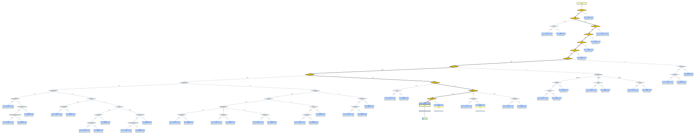

# spreadsheethurts


## Installation

This project uses Python and Node.js.

### Python

It is recommended to use `uv` for managing Python dependencies.

To install the required packages, run:
```bash
uv sync
```

### Node.js

Node.js is used for plotting. You can use `pnpm` or `npm` to install the dependencies.

```bash
# Using pnpm
pnpm install

# Or using npm
npm install
```


## Decision Trees

This repository contains the typecasting decision trees for various spreadsheet applications. These visualizations illustrate the logic used to determine data types from raw string inputs.

### Features

Features are the building blocks of the decision trees, representing the individual decision nodes. The feature logic for each spreadsheet is located in its respective directory under `src/wizard/features/` (e.g., `src/wizard/features/excel` for Excel).

### Visualization

The decision tree diagrams are generated using a js script that processes the tree structure and renders it as an SVG image.

For example, the decision tree for Microsoft Excel is shown below. You can find other decision trees in the `assets` directory.



